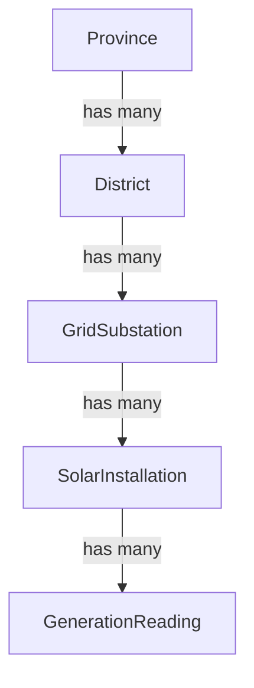
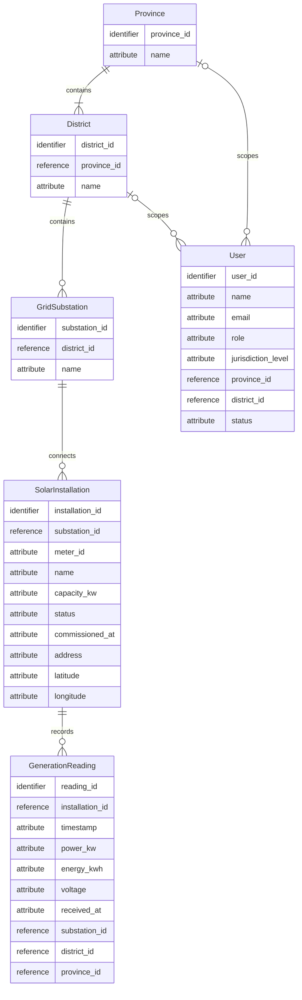
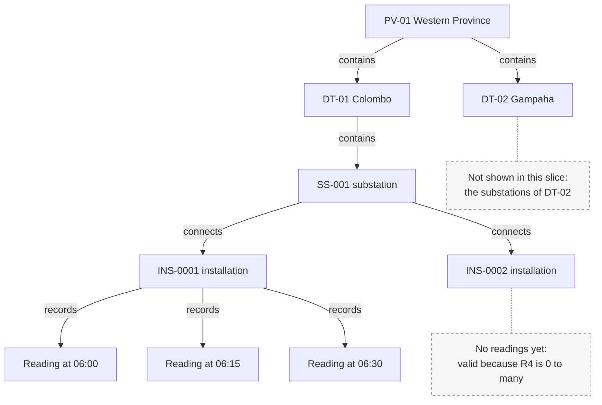
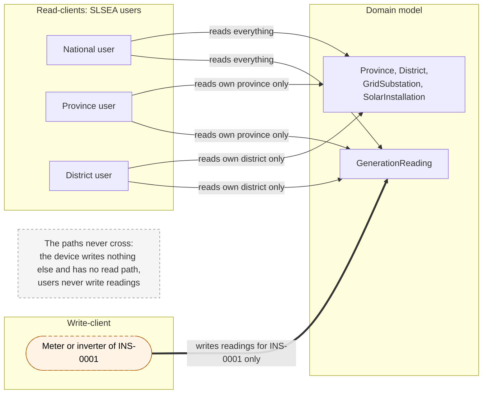

# Architecture Decision Record (ADR) & Design Reasoning — Data Model

**Project:** Sri Lanka Sustainable Energy Authority (SLSEA) — Real-Time Solar Generation Data API  
**Target Runtime:** Node.js (LTS) / Express.js  
**Database:** MongoDB Atlas (via Mongoose ODM)  
**Authentication:** JWT bearer tokens with scopes  
**API Documentation:** OpenAPI 3 (Swagger UI)  
**Hosting:** Render (HTTPS)  
**Design Authority:** REST API Design Guidelines (WSO2 design spine, step 1: data model)  
**Model Independence:** The stack above is where this model will be implemented. Sections 1–7 are deliberately implementation-independent, with no collections, data types, keys or JSON. Only section 8 maps the model to MongoDB.

## 1. Domain hierarchy

Each level has many of the level below it, and every child belongs to exactly one parent. User (read scope) is shown in the ER diagram, and the meter or inverter (an external write-client, not an entity) is shown in the write-read split.

## 2. ER diagram

Notation key: `||` exactly one, `|o` zero or one, `|{` one or more, `o{` zero or more. The words "identifier" (the entity's own identity), "reference" (the identity of a related entity) and "attribute" (a plain property) fill Mermaid's required type slot and are not data types.

## 3. Relationships

Sample ids (PV-01, DT-01, SS-001, INS-0001, USR-001) follow the formats chosen in section 8. Readings get generated ids, so the examples refer to them by their time.

### R1. Province contains District

| | |
|---|---|
| Cardinality | Province → District: **1 to 1..\***. District → Province: **exactly 1**. |
| In plain English | A province contains one or more districts, and every district belongs to exactly one province. |
| Why | Sri Lanka's 9 provinces are each made up of districts (25 in total). A province with no districts is not a real province, and a district cannot sit in two provinces. See D6. |
| Instance | PV-01 (Western) has DT-01 (Colombo) and DT-02 (Gampaha). DT-01 belongs only to PV-01. |

### R2. District contains GridSubstation

| | |
|---|---|
| Cardinality | District → GridSubstation: **1 to 0..\***. GridSubstation → District: **exactly 1**. |
| In plain English | A district contains zero or more grid substations, and every substation is located in exactly one district. |
| Why | A substation is a physical grid node in one place. Zero is allowed because the model should not assume every district already has a registered substation (D6). The seed data still gives every district at least one. |
| Instance | DT-01 has SS-001. SS-001 is located only in DT-01. |

### R3. GridSubstation connects SolarInstallation

| | |
|---|---|
| Cardinality | GridSubstation → SolarInstallation: **1 to 0..\***. SolarInstallation → GridSubstation: **exactly 1**. |
| In plain English | A substation connects zero or more installations, and every installation feeds the grid through exactly one substation. |
| Why | A rooftop site has one grid connection point. A newly commissioned substation may have no sites connected yet (D6). |
| Instance | SS-001 connects INS-0001 and INS-0002. INS-0001 connects only to SS-001. |

### R4. SolarInstallation records GenerationReading

| | |
|---|---|
| Cardinality | SolarInstallation → GenerationReading: **1 to 0..\***. GenerationReading → SolarInstallation: **exactly 1**. |
| In plain English | An installation records zero or more readings over time, and every reading belongs to exactly one installation. |
| Why | A reading means nothing without the site that produced it. A site that has just been registered has no readings yet, so zero must be valid (D2, D6). |
| Instance | INS-0001 has readings at 06:00, 06:15 and 06:30, one per reporting interval. INS-0002 has no readings yet. |

### R5. Province scopes User

| | |
|---|---|
| Cardinality | Province → User: **1 to 0..\***. User → Province: **0 or 1**. |
| In plain English | A province may be the read scope of any number of users, and a user is scoped to at most one province. |
| Why | Province-level SLSEA users read only their own province. District and national users have no province link, so the user side is optional (D4). |
| Instance | USR-001, a province user, is scoped to PV-01 and can read DT-01, DT-02 and everything under them. |

### R6. District scopes User

| | |
|---|---|
| Cardinality | District → User: **1 to 0..\***. User → District: **0 or 1**. |
| In plain English | A district may be the read scope of any number of users, and a user is scoped to at most one district. |
| Why | District-level SLSEA users read only their own district. Province and national users have no district link (D4). |
| Instance | USR-002, a district user, is scoped to DT-01 and can read SS-001, INS-0001, INS-0002 and their readings, but nothing in DT-02. |

**Jurisdiction rule (model constraint).** Every user has exactly **one** jurisdiction. National: no R5 or R6 link. Province: one R5 link and no R6 link. District: one R6 link and no R5 link. Crow's-foot notation cannot express "at most one of these two links", so the rule is stated here (D4).

### Instance slice

One slice of the data, using the sample ids above. The ids are labels only.

## 4. Attributes

All names are snake_case. Units are part of the name where a value has one (`_kw`, `_kwh`), and `_at` marks a point in time. The brief sets a minimum only for GenerationReading, so every other attribute has a one-line justification.

### Province

| Attribute | Meaning | Why it is here |
|---|---|---|
| `province_id` | Identity of the province | Every entity needs its own identity. |
| `name` | Official province name, e.g. Western | Lets users recognise the jurisdiction without decoding an id. |

### District

| Attribute | Meaning | Why it is here |
|---|---|---|
| `district_id` | Identity of the district | Every entity needs its own identity. |
| `province_id` | The province the district belongs to | Records R1, so every district can be traced to its province. |
| `name` | Official district name, e.g. Colombo | Lets users recognise the jurisdiction without decoding an id. |

### GridSubstation

| Attribute | Meaning | Why it is here |
|---|---|---|
| `substation_id` | Identity of the substation | Every entity needs its own identity. |
| `district_id` | The district the substation is located in | Records R2, so every substation can be traced to its district. |
| `name` | Name of the grid node | Operators know substations by name, not by id. |

### SolarInstallation

| Attribute | Meaning | Why it is here |
|---|---|---|
| `installation_id` | Identity of the rooftop site | Every entity needs its own identity; devices authenticate as this installation. |
| `substation_id` | The substation the site feeds into | Records R3, so every site can be traced up to its district and province. |
| `meter_id` | Identifier of the site's smart meter or inverter | The device is an attribute of the site, not an entity (D1), and it is how a device is recognised when it reports. |
| `name` | Human-readable site label | Lets analysts tell sites apart on a dashboard. |
| `capacity_kw` | Rated panel capacity in kW | Shows how much of its possible output a site is producing, and lets summaries report total capacity. |
| `status` | `active` or `inactive` | A decommissioned site can be marked inactive instead of deleted, so its readings keep a valid owner (D7). |
| `commissioned_at` | When the site started generating | Explains why a site has no readings before that point, and lets analysts compare new and old sites. |
| `address` | Street address of the site | Lets field staff locate the site. |
| `latitude`, `longitude` | Geographic position of the site | Allows the site to be placed on a map, which a dashboard needs and an address alone can't do. |

### GenerationReading

| Attribute | Meaning | Why it is here |
|---|---|---|
| `reading_id` | Identity of the reading | A single reading must be referable on its own, for example after it has just been recorded. |
| `installation_id` | The installation that produced the reading | Brief minimum (the owning installation); records R4. |
| `timestamp` | When the device took the measurement | Brief minimum. |
| `power_kw` | Instantaneous power output in kW at `timestamp` | Brief minimum. |
| `energy_kwh` | Cumulative energy in kWh since the meter started; it never decreases | Brief minimum. Energy in a period is the difference between two readings, so a missed reading loses no energy. |
| `voltage` | Grid voltage at the site in volts at `timestamp` | Brief minimum. |
| `received_at` | When the system received the reading | Separates device time from arrival time, so delayed or resent readings can be spotted and a wrong device clock doesn't go unnoticed. |
| `substation_id` | The installation's substation when the reading was recorded | Copied from the installation so "readings on this substation" needs no lookup through the installation. |
| `district_id` | The installation's district when the reading was recorded | Copied so a district user's read scope and the district generation summary can be applied directly to readings. |
| `province_id` | The installation's province when the reading was recorded | Copied so a province user's read scope can be applied directly to readings. |

The three copied ids are safe because a reading is never changed (D7). If a site is later reconnected to another substation, its old readings keep the location they were actually recorded under, which is the correct history.

### User

| Attribute | Meaning | Why it is here |
|---|---|---|
| `user_id` | Identity of the SLSEA user | Every entity needs its own identity. |
| `name` | The person's name | Shows who an account belongs to. |
| `email` | The person's work email | A unique, familiar way for the person to identify themselves when signing in. |
| `role` | What the user is allowed to do, e.g. analyst or registry admin | The brief's User has a role, and read access and registry maintenance are different permissions. |
| `jurisdiction_level` | `national`, `province` or `district` | States the user's single jurisdiction explicitly (D4). |
| `province_id` | The province a province-level user is scoped to | Records R5; present only when `jurisdiction_level` is `province`. |
| `district_id` | The district a district-level user is scoped to | Records R6; present only when `jurisdiction_level` is `district`. |
| `status` | `active` or `inactive` | Access can be withdrawn without deleting the person's record. |

### Considered and left out

| Attribute | Why it is left out |
|---|---|
| `peak_power_kw`, `min_power_kw` on GenerationReading | Each reading is a snapshot. Peaks and dips between snapshots are not captured, and this is stated as a limitation in the critical evaluation. |
| Last-value fields such as `last_power_kw` on SolarInstallation | "Current" comes from the latest reading (D2). |
| Device secrets and password storage | How credentials are stored is an implementation and security decision, so it is added in the security phase, not in this model. |

## 5. Write-read split

- **Write path.** A device authenticates as its installation and pushes readings for that installation only, and can write nothing else. Giving it no read path is our design choice, which the security phase enforces.
- **Read path.** National, provincial and district users read data scoped by their jurisdiction, and never write generation readings.
- At model level, there is no relationship between User and GenerationReading and no Device entity, so neither path appears in the other (D5).

### Client permissions

"Own province" and "own district" mean the user's single jurisdiction (D4) and everything under it in the hierarchy.

| Client | Province | District | GridSubstation | SolarInstallation | GenerationReading |
|---|---|---|---|---|---|
| Meter device | None | None | None | None | **Write:** add new readings for its own installation only. No read. |
| National user | Read all | Read all | Read all | Read all | Read all |
| Province user | Read own province | Read districts in own province | Read substations in own province | Read installations in own province | Read readings in own province |
| District user | None | Read own district | Read substations in own district | Read installations in own district | Read readings in own district |
| Registry admin | Read all | Read all | Read all | Read all; **write:** register, replace and remove installations | None |

What the table shows:
- **Exactly one client writes readings: the device, and only for its own installation.** It cannot read anything, including its own past readings.
- **No client changes or removes a reading** (D7). Removing an installation leaves its readings in place as history.
- **SLSEA users write nothing.** National, province and district users differ only in how much of the hierarchy they can read.
- **The registry admin maintains installations but never touches readings.** It reads the hierarchy so it can attach a new installation to the right substation.
- **Province, District and GridSubstation are written by no client.** They are fixed reference data loaded with the seed, so no client needs to change them.
- **User accounts are not managed by any client.** They are created with the seed, so no client can grant itself a wider jurisdiction or role.

## 6. Core architectural decisions

### D1. The meter id is an attribute, not a Device entity

| | |
|---|---|
| Decision | The meter or inverter identifier (`meter_id`) is an attribute of SolarInstallation. There is no Device entity. |
| Context | Each installation has one smart meter or inverter that pushes its readings. |
| Alternatives considered | (a) A Device entity with a 1:1 link to SolarInstallation. (b) A Device entity that owns the readings. |
| Why this choice | The device has no identity or life of its own in this domain: it exists only to report for the one site it is fitted to. A separate entity would add a 1:1 relationship that carries no information. |
| Consequence / trade-off | Swapping a meter means changing an attribute of the installation, so meter history is not modelled. That is acceptable because SLSEA's questions are about sites and generation, not hardware. |

### D2. GenerationReading is its own append-only time series

| | |
|---|---|
| Decision | Every reading is its own GenerationReading, linked to one installation. The installation holds no last-value fields. |
| Context | Devices report at a fixed interval (15 minutes in our seed). SLSEA needs both "what is generating now" and historical analysis. |
| Alternatives considered | (a) Last-value fields such as `last_power` on SolarInstallation. (b) Both last-value fields and a history. |
| Why this choice | Last-value fields overwrite the past, so the analytical questions cannot be answered. "Current" is derived later from the latest reading (the composite and last-known-reading resources), so nothing is stored twice. |
| Consequence / trade-off | Readings are by far the largest part of the data (about 167,000 for 8 days of seed), so later steps need pagination and an efficient way to find the latest reading. |

### D3. GridSubstation is its own level between District and SolarInstallation

| | |
|---|---|
| Decision | GridSubstation is an entity. Each installation connects to one substation, and each substation sits in one district. |
| Context | The brief's hierarchy has five levels, and the brief requires filtering by substation as well as province and district. |
| Alternatives considered | (a) A substation name stored as an attribute of SolarInstallation. (b) Installations linked straight to District. |
| Why this choice | A substation has its own identity and is shared by many installations, so it is a thing in the domain, not a property of one site. Without the level, "all sites on this grid node" can't be expressed. |
| Consequence / trade-off | One more hop between a reading and its district. District and province queries avoid walking every level because readings carry copies of the jurisdiction ids (section 4) and those copies are indexed (section 8). |

### D4. A user has exactly one jurisdiction, with no Jurisdiction entity

| | |
|---|---|
| Decision | Every user is national, or linked to one province, or linked to one district. There is no separate Jurisdiction entity. |
| Context | A user is an SLSEA person with a role and a single jurisdiction. |
| Alternatives considered | (a) A Jurisdiction entity that users point to. (b) A many-to-many link so one user can cover several districts. |
| Why this choice | Province and District already are the jurisdictions, so a Jurisdiction entity would duplicate them. One scope per user keeps the read rule simple to state, enforce and test. |
| Consequence / trade-off | "Exactly one of these" is a rule that crow's-foot notation can't draw, so it is stated in text and must be enforced later. A user who covers two districts needs a broader scope or two accounts. This is a known limitation. |

### D5. Write and read are separated at model level

| | |
|---|---|
| Decision | User has no relationship with GenerationReading. The device that writes readings is an actor outside the model, not a User and not an entity. |
| Context | The brief has two different kinds of client, with different permissions. |
| Alternatives considered | (a) User "produces" or "owns" readings, like a person logging their own output. (b) Devices modelled as a kind of User. |
| Why this choice | The data producer and the data consumer are different parties. If the model linked users to readings, the security model would have nothing to enforce the split against. |
| Consequence / trade-off | The registry administrator role used later for installation maintenance is still a User and still never writes readings. Device credentials have to be designed separately from user accounts in the security phase. |

### D6. Cardinality choices

| | |
|---|---|
| Decision | Province → District is 1..\*. District → GridSubstation, GridSubstation → SolarInstallation and SolarInstallation → GenerationReading are 0..\*. |
| Context | The brief says only "has many" for each level, so the minimum is our decision. |
| Alternatives considered | (a) 1..\* at every level. (b) 0..\* at every level. |
| Why this choice | Provinces and districts are fixed real-world geography: every province has districts. The lower levels are registered over time, so a new district, substation or installation can exist before anything is attached to it. Our seed deliberately includes 2–3 installations with no readings to show this. |
| Consequence / trade-off | Later steps must treat "no children" as a normal, empty result, not as an error. |

### D7. Readings are never updated or deleted

| | |
|---|---|
| Decision | Once recorded, a GenerationReading is never changed or removed. New readings are only ever appended. |
| Context | Readings are measurements reported by the device at a point in time. |
| Alternatives considered | (a) Allow corrections by editing a reading. (b) Delete readings when their installation is removed. |
| Why this choice | The readings are SLSEA's evidence of what was generated. Editing or deleting them would make the history untrustworthy. |
| Consequence / trade-off | A faulty reading cannot be fixed in place. Removing an installation keeps its readings as history. Duplicate readings are rejected by a unique index (section 8). |

### Decision summary

| # | Decision |
|---|---|
| D1 | `meter_id` is an attribute of SolarInstallation; no Device entity |
| D2 | GenerationReading is its own append-only time series; no last-value fields |
| D3 | GridSubstation is its own level between District and SolarInstallation |
| D4 | Each user has exactly one jurisdiction; no Jurisdiction entity |
| D5 | User never produces readings; the device is outside the model |
| D6 | Province → District is 1..\*; the other levels are 0..\* |
| D7 | Readings are never updated or deleted |

## 7. Deliberately excluded

| Excluded | Why it is excluded | Common mistake it avoids |
|---|---|---|
| Device (Meter) entity | The device only reports for one site, so its id is an attribute (D1). | Inventing a separate Device or Meter entity |
| Last-value fields on SolarInstallation | They overwrite history; "current" is derived from the latest reading (D2). | Storing `last_power_kw`-style last-value fields instead of history |
| Collection entities (e.g. "Installations") | A collection is a resource derived later from client needs, not a thing in the domain. | Putting API collections into the data model |
| User–GenerationReading relationship | Users are read-clients and never produce readings (D5). | Treating the user as the data producer |
| Format names in the model (e.g. `json_payload`) | The model is implementation-independent; formats are decided at the representation step. | Baking format names into the data model |

---

## 8. Implementation mapping (MongoDB)

> **This section is implementation, not model.** Sections 1–7 describe the domain without any technology. This section records how that model is stored in MongoDB Atlas through Mongoose. If the database changed, only this section would change.

### 8.1 Collections

| Entity | Collection | Fields stored |
|---|---|---|
| Province | `provinces` | `_id`, `name` |
| District | `districts` | `_id`, `province_id`, `name` |
| GridSubstation | `grid_substations` | `_id`, `district_id`, `name` |
| SolarInstallation | `installations` | `_id`, `substation_id`, `district_id`, `province_id`, `meter_id`, `name`, `capacity_kw`, `status`, `commissioned_at`, `address`, `latitude`, `longitude`, `created_at`, `updated_at` |
| GenerationReading | `generation_readings` | `_id`, `installation_id`, `timestamp`, `power_kw`, `energy_kwh`, `voltage`, `received_at`, `substation_id`, `district_id`, `province_id` |
| User | `users` | `_id`, `name`, `email`, `role`, `jurisdiction_level`, `province_id`, `district_id`, `status`, `created_at`, `updated_at` |

- **One collection per entity.** Each level of the hierarchy is stored and queried on its own, not nested inside its parent.
- **Collection names are set explicitly.** Mongoose would otherwise derive names such as `gridsubstations`.
- **`_id` holds the readable id** (8.2). It is shown to clients as the entity's own id field (`province_id`, `installation_id`, and so on).
- **`created_at` and `updated_at` exist only on collections that can change.** They will feed the Last-Modified header. Readings never change (D7), so `received_at` plays that role for them.
- **Installations also store `district_id` and `province_id`.** These aren't attributes in the model; they are copies taken from the installation's substation. With them, installations can be filtered and scope-checked by district or province without loading the substation first. Unlike readings, an installation can be replaced, so the copies are recalculated from the substation whenever `substation_id` is set.
- **Credential fields are added in the security phase:** a device secret hash on installations and a password hash on users.

### 8.2 Identifiers

| Entity | Format | Example | Seed range |
|---|---|---|---|
| Province | `PV-` + 2 digits | `PV-01` | `PV-01` to `PV-09` |
| District | `DT-` + 2 digits | `DT-01` | `DT-01` to `DT-25` |
| GridSubstation | `SS-` + 3 digits | `SS-001` | at least one per district |
| SolarInstallation | `INS-` + 4 digits | `INS-0001` | about `INS-0001` to `INS-0220` |
| User | `USR-` + 3 digits | `USR-001` | one or more per role and level |
| GenerationReading | generated 24-character hex string | `66f2c1a9e4b0a1b2c3d4e5f6` | about 167,000 |
| `meter_id` (an attribute, not an `_id`) | `MTR-` + 6 digits | `MTR-000001` | one per installation |

- **Readable codes are used for everything people refer to.** Analysts, admins and markers read and type these ids, they appear in URIs, and a seed file full of `DT-01` can be checked by eye.
- **Readings get generated ids.** Devices create them at volume and nobody types them. A running counter would need coordinating between concurrent device writes, and a generated id needs no coordination.
- **Every `_id` is stored as a string, including reading ids.** An unknown or badly formed id is then simply "not found", not a conversion error.
- **There is room to grow.** Four digits allow 9,999 installations. Because ids are strings, a longer form such as `INS-10000` can be added later without changing anything, although sorting by id would then stop matching numeric order.

### 8.3 Parent references

| Child collection | Reference field | Points to |
|---|---|---|
| `districts` | `province_id` | `provinces._id` |
| `grid_substations` | `district_id` | `districts._id` |
| `installations` | `substation_id` | `grid_substations._id` |
| `generation_readings` | `installation_id` | `installations._id` |
| `users` | `province_id` or `district_id` | `provinces._id` or `districts._id` |

- **Each child stores its parent's readable id.** Most reads can show the parent id without a lookup.
- **MongoDB has no foreign keys, so integrity is enforced in code.** The service layer checks that the parent exists before it creates or replaces a child. The seed script checks every reference before inserting anything. This is a known limitation of the storage choice.
- **The jurisdiction rule (D4) is enforced by validation on `users`.** `national` has neither `province_id` nor `district_id`. `province` has only `province_id`. `district` has only `district_id`.

### 8.4 Denormalised jurisdiction ids on readings

- **Set by the server when the reading is stored.** `substation_id`, `district_id` and `province_id` are copied from the installation document, never taken from the device's request. A device therefore can't place its readings in the wrong district.
- **Never updated.** Readings never change (D7), so the copies can't drift out of step. If an installation is later reconnected elsewhere, its old readings keep the location they were recorded under.
- **Used by the district generation summary and by jurisdiction checks.** Both can match on `district_id` directly, without joining readings to installations, substations and districts.
- **The cost is small.** Three short strings per reading add roughly 10 MB across the seed's 167,000 readings, well inside the Atlas M0 limit of 512 MB.

### 8.5 Indexes

| Collection | Index | Unique | What it serves |
|---|---|---|---|
| `generation_readings` | `{ installation_id: 1, timestamp: -1 }` | **Yes** | Rejects a second reading for the same installation and time (for example a device retry). Also finds the latest reading, and pages, sorts and time-filters one installation's history. |
| `generation_readings` | `{ district_id: 1, timestamp: -1 }` | No | District generation summary and district-scoped reading queries. |
| `installations` | `{ meter_id: 1 }` | **Yes** | One meter per installation; finds the installation when a device signs in. |
| `installations` | `{ substation_id: 1 }`, `{ district_id: 1 }`, `{ province_id: 1 }` | No | Filtering installations by substation, district or province, and jurisdiction scope. |
| `grid_substations` | `{ district_id: 1 }` | No | Filtering substations by district. |
| `districts` | `{ province_id: 1 }` | No | Filtering districts by province. |
| `users` | `{ email: 1 }` | **Yes** | One account per email; finds the user at sign-in. |

- **Every `_id` is unique automatically**, so no index is declared for it.
- **`timestamp: -1` stores newest first**, which matches the most common read. MongoDB can walk the same index backwards for oldest-first.
- **`substation_id` and `province_id` on readings are stored but not indexed.** No planned query needs them yet. Every index slows each write, and readings are written about 96 times a day per installation, so an index is added only when a query needs it.

### 8.6 Why readings are not embedded in the installation

- **The array would grow without limit.** An installation adds 96 readings a day, every day. MongoDB caps a document at 16 MB, which at roughly 200 bytes per reading is reached in about two to three years, and the document gets slow to load long before that.
- **Every read of an installation would load its whole history**, and every new reading would rewrite a growing document.
- **Readings need their own identity and their own queries.** A newly created reading needs an id the client can use, and history needs paging, time-window filtering, sorting and district-wide totals. All of that is natural on a collection and awkward on an array.
- **The "one reading per installation per time" rule couldn't be enforced.** A unique index prevents duplicates across documents, not inside one document's array.
- **It is a short step from an embedded array to last-value fields on the installation**, the mistake D2 rules out.

### 8.7 Why readings are not a MongoDB time-series collection

- **Time-series collections are built for this shape of data.** They bucket readings by time and source, compress them and scan time ranges quickly. That is a real advantage, and it is named as a trade-off.
- **But they can't have a unique index.** Without the unique `{ installation_id, timestamp }` index, a device that retries after a network failure would store the same reading twice, and the duplicates would show up in history pages and counts.
- **Their limits on changing and deleting data are not a reason against them**, since readings are append-only anyway (D7).
- **At this scale an ordinary collection is fast enough.** For about 167,000 readings, an ordinary collection with the compound index serves every planned query. The compression benefit matters only at national scale, which goes into the critical evaluation as a limitation.

### 8.8 Storage alternatives

| Option | What it would look like | What it would gain | Why it was not chosen |
|---|---|---|---|
| Readings embedded in the installation | A `readings` array inside each installation document | One read returns a site and its history | 16 MB document limit, no per-reading identity, no unique rule per installation and time, and it invites last-value fields (8.6). |
| MongoDB time-series collection | `generation_readings` created as a time-series collection keyed on `timestamp` and `installation_id` | Compression, time bucketing and fast range scans | No unique index, so device retries create duplicate readings (8.7). |
| Relational database (e.g. PostgreSQL) | One table per entity with real foreign keys and a unique constraint on installation and time | Referential integrity enforced by the database, plus SQL joins and aggregation | The project's chosen stack is MongoDB on Atlas's free tier, and documents map directly to the JSON representations. The cost is that integrity is enforced in code and by the seed check (8.3), which is stated as a limitation. |
| **Chosen:** ordinary collection with a unique compound index | `generation_readings` as a normal collection, one document per reading | Unique rule enforced by the database, every planned query indexed, simple to explain | Weaker compression than a time-series collection at national scale. |
