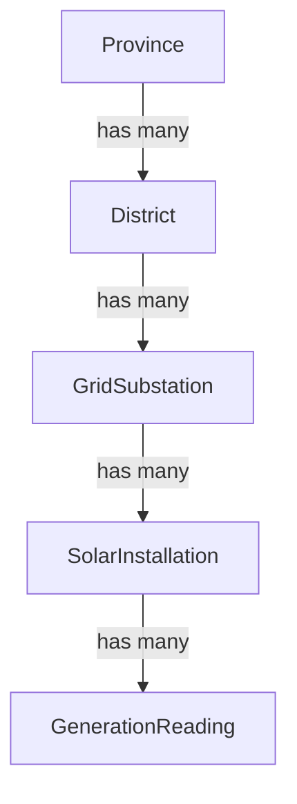
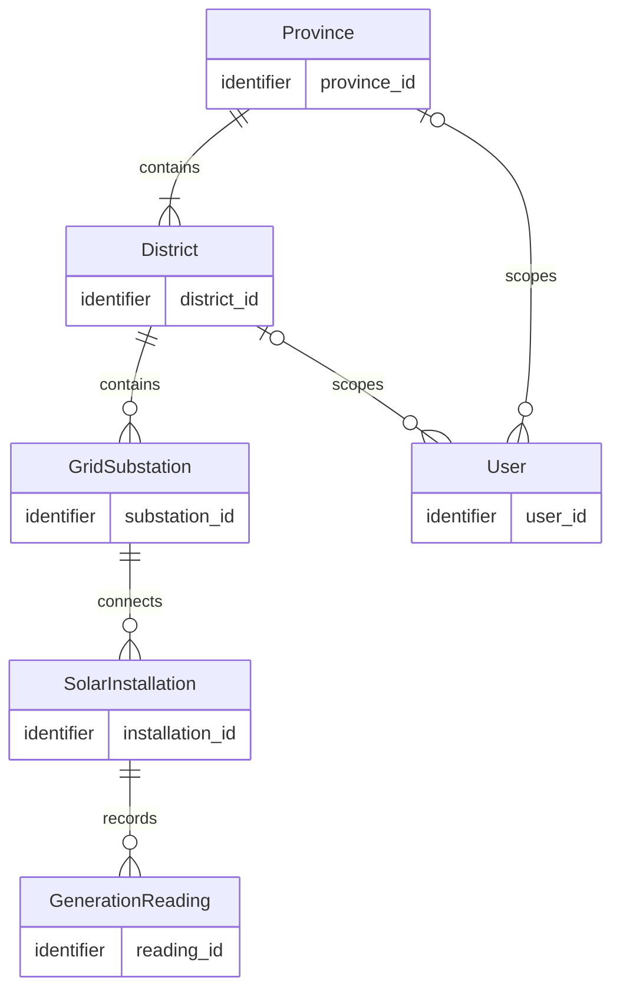
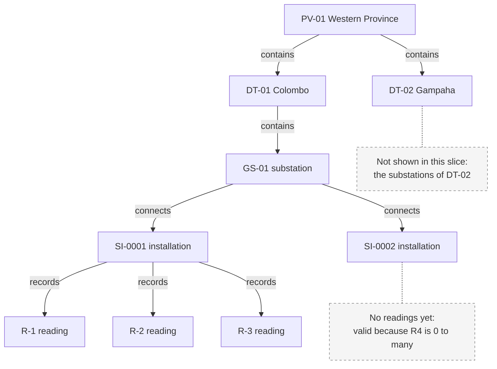
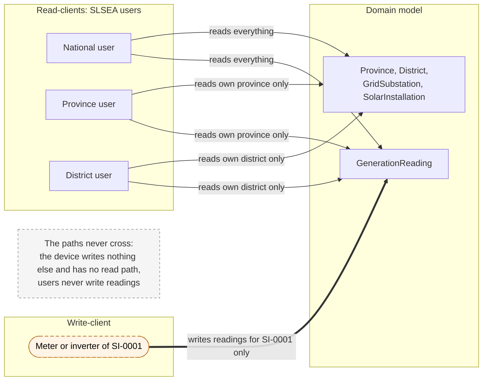

# Architecture Decision Record (ADR) & Design Reasoning — Data Model

**Project:** Sri Lanka Sustainable Energy Authority (SLSEA) — Real-Time Solar Generation Data API  
**Target Runtime:** Node.js (LTS) / Express.js  
**Database:** MongoDB Atlas (via Mongoose ODM)  
**Authentication:** JWT bearer tokens with scopes  
**API Documentation:** OpenAPI 3 (Swagger UI)  
**Hosting:** Render (HTTPS)  
**Design Authority:** REST API Design Guidelines (WSO2 design spine, step 1: data model)  
**Model Independence:** The stack above is where this model will be implemented (from Step 1.5). The model in this document is deliberately implementation-independent, with no collections, data types, keys or JSON.

## 1. Domain hierarchy

Each level has many of the level below it, and every child belongs to exactly one parent. User (read scope) is shown in the ER diagram, and the meter or inverter (an external write-client, not an entity) is shown in the write-read split.

## 2. ER diagram

Notation key: `||` exactly one, `|o` zero or one, `|{` one or more, `o{` zero or more; "identifier" fills Mermaid's required type slot and is not a data type.

## 3. Relationships

Sample ids (PV-01, DT-01, GS-01, SI-0001, R-1, U-01) are illustrative labels for explaining the model. They are not an identifier format; that is decided in Step 1.5.

### R1. Province contains District

| | |
|---|---|
| Cardinality | Province → District: **1 to 1..\***. District → Province: **exactly 1**. |
| In plain English | A province contains one or more districts, and every district belongs to exactly one province. |
| Why | Sri Lanka's 9 provinces are each made up of districts (25 in total). A province with no districts is not a real province, and a district cannot sit in two provinces. See D6. |
| Instance | PV-01 (Western) has DT-01 (Colombo) and DT-02 (Gampaha). DT-01 belongs only to PV-01. |

### R2. District contains GridSubstation

| | |
|---|---|
| Cardinality | District → GridSubstation: **1 to 0..\***. GridSubstation → District: **exactly 1**. |
| In plain English | A district contains zero or more grid substations, and every substation is located in exactly one district. |
| Why | A substation is a physical grid node in one place. Zero is allowed because the model should not assume every district already has a registered substation (D6). The seed data still gives every district at least one. |
| Instance | DT-01 has GS-01. GS-01 is located only in DT-01. |

### R3. GridSubstation connects SolarInstallation

| | |
|---|---|
| Cardinality | GridSubstation → SolarInstallation: **1 to 0..\***. SolarInstallation → GridSubstation: **exactly 1**. |
| In plain English | A substation connects zero or more installations, and every installation feeds the grid through exactly one substation. |
| Why | A rooftop site has one grid connection point. A newly commissioned substation may have no sites connected yet (D6). |
| Instance | GS-01 connects SI-0001 and SI-0002. SI-0001 connects only to GS-01. |

### R4. SolarInstallation records GenerationReading

| | |
|---|---|
| Cardinality | SolarInstallation → GenerationReading: **1 to 0..\***. GenerationReading → SolarInstallation: **exactly 1**. |
| In plain English | An installation records zero or more readings over time, and every reading belongs to exactly one installation. |
| Why | A reading means nothing without the site that produced it. A site that has just been registered has no readings yet, so zero must be valid (D2, D6). |
| Instance | SI-0001 has R-1, R-2 and R-3, one per reporting interval. SI-0002 has no readings yet. |

### R5. Province scopes User

| | |
|---|---|
| Cardinality | Province → User: **1 to 0..\***. User → Province: **0 or 1**. |
| In plain English | A province may be the read scope of any number of users, and a user is scoped to at most one province. |
| Why | Province-level SLSEA users read only their own province. District and national users have no province link, so the user side is optional (D4). |
| Instance | U-01, a province user, is scoped to PV-01 and can read DT-01, DT-02 and everything under them. |

### R6. District scopes User

| | |
|---|---|
| Cardinality | District → User: **1 to 0..\***. User → District: **0 or 1**. |
| In plain English | A district may be the read scope of any number of users, and a user is scoped to at most one district. |
| Why | District-level SLSEA users read only their own district. Province and national users have no district link (D4). |
| Instance | U-02, a district user, is scoped to DT-01 and can read GS-01, SI-0001, SI-0002 and their readings, but nothing in DT-02. |

**Jurisdiction rule (model constraint).** Every user has exactly **one** jurisdiction. National: no R5 or R6 link. Province: one R5 link and no R6 link. District: one R6 link and no R5 link. Crow's-foot notation cannot express "at most one of these two links", so the rule is stated here (D4).

### Instance slice

One slice of the data, using the sample ids above. The ids are labels only.

## 4. Write-read split

- **Write path.** A device authenticates as its installation and pushes readings for that installation only, and can write nothing else. Giving it no read path is our design choice, which the security phase enforces.
- **Read path.** National, provincial and district users read data scoped by their jurisdiction, and never write generation readings.
- At model level, there is no relationship between User and GenerationReading and no Device entity, so neither path appears in the other (D5).

## 5. Core architectural decisions

### D1. The meter id is an attribute, not a Device entity

| | |
|---|---|
| Decision | The meter or inverter identifier (`meter_id`) is an attribute of SolarInstallation. There is no Device entity. |
| Context | Each installation has one smart meter or inverter that pushes its readings. |
| Alternatives considered | (a) A Device entity with a 1:1 link to SolarInstallation. (b) A Device entity that owns the readings. |
| Why this choice | The device has no identity or life of its own in this domain: it exists only to report for the one site it is fitted to. A separate entity would add a 1:1 relationship that carries no information. |
| Consequence / trade-off | Swapping a meter means changing an attribute of the installation, so meter history is not modelled. That is acceptable because SLSEA's questions are about sites and generation, not hardware. |

### D2. GenerationReading is its own append-only time series

| | |
|---|---|
| Decision | Every reading is its own GenerationReading, linked to one installation. The installation holds no last-value fields. |
| Context | Devices report at a fixed interval (15 minutes in our seed). SLSEA needs both "what is generating now" and historical analysis. |
| Alternatives considered | (a) Last-value fields such as `last_power` on SolarInstallation. (b) Both last-value fields and a history. |
| Why this choice | Last-value fields overwrite the past, so the analytical questions cannot be answered. "Current" is derived later from the latest reading (the composite and last-known-reading resources), so nothing is stored twice. |
| Consequence / trade-off | Readings are by far the largest part of the data (about 167,000 for 8 days of seed), so later steps need pagination and an efficient way to find the latest reading. |

### D3. GridSubstation is its own level between District and SolarInstallation

| | |
|---|---|
| Decision | GridSubstation is an entity. Each installation connects to one substation, and each substation sits in one district. |
| Context | The brief's hierarchy has five levels, and the brief requires filtering by substation as well as province and district. |
| Alternatives considered | (a) A substation name stored as an attribute of SolarInstallation. (b) Installations linked straight to District. |
| Why this choice | A substation has its own identity and is shared by many installations, so it is a thing in the domain, not a property of one site. Without the level, "all sites on this grid node" can't be expressed. |
| Consequence / trade-off | One more hop between a reading and its district. How district and province queries avoid walking every level is decided in Steps 1.2 and 1.5. |

### D4. A user has exactly one jurisdiction, with no Jurisdiction entity

| | |
|---|---|
| Decision | Every user is national, or linked to one province, or linked to one district. There is no separate Jurisdiction entity. |
| Context | A user is an SLSEA person with a role and a single jurisdiction. |
| Alternatives considered | (a) A Jurisdiction entity that users point to. (b) A many-to-many link so one user can cover several districts. |
| Why this choice | Province and District already are the jurisdictions, so a Jurisdiction entity would duplicate them. One scope per user keeps the read rule simple to state, enforce and test. |
| Consequence / trade-off | "Exactly one of these" is a rule that crow's-foot notation can't draw, so it is stated in text and must be enforced later. A user who covers two districts needs a broader scope or two accounts. This is a known limitation. |

### D5. Write and read are separated at model level

| | |
|---|---|
| Decision | User has no relationship with GenerationReading. The device that writes readings is an actor outside the model, not a User and not an entity. |
| Context | The brief has two different kinds of client, with different permissions. |
| Alternatives considered | (a) User "produces" or "owns" readings, like a person logging their own output. (b) Devices modelled as a kind of User. |
| Why this choice | The data producer and the data consumer are different parties. If the model linked users to readings, the security model would have nothing to enforce the split against. |
| Consequence / trade-off | The registry administrator role used later for installation maintenance is still a User and still never writes readings. Device credentials have to be designed separately from user accounts in the security phase. |

### D6. Cardinality choices

| | |
|---|---|
| Decision | Province → District is 1..\*. District → GridSubstation, GridSubstation → SolarInstallation and SolarInstallation → GenerationReading are 0..\*. |
| Context | The brief says only "has many" for each level, so the minimum is our decision. |
| Alternatives considered | (a) 1..\* at every level. (b) 0..\* at every level. |
| Why this choice | Provinces and districts are fixed real-world geography: every province has districts. The lower levels are registered over time, so a new district, substation or installation can exist before anything is attached to it. Our seed deliberately includes 2–3 installations with no readings to show this. |
| Consequence / trade-off | Later steps must treat "no children" as a normal, empty result, not as an error. |

### D7. Readings are never updated or deleted

| | |
|---|---|
| Decision | Once recorded, a GenerationReading is never changed or removed. New readings are only ever appended. |
| Context | Readings are measurements reported by the device at a point in time. |
| Alternatives considered | (a) Allow corrections by editing a reading. (b) Delete readings when their installation is removed. |
| Why this choice | The readings are SLSEA's evidence of what was generated. Editing or deleting them would make the history untrustworthy. |
| Consequence / trade-off | A faulty reading cannot be fixed in place. Removing an installation keeps its readings as history. How duplicate readings are rejected is decided in Step 1.5. |

### Decision summary

| # | Decision |
|---|---|
| D1 | `meter_id` is an attribute of SolarInstallation; no Device entity |
| D2 | GenerationReading is its own append-only time series; no last-value fields |
| D3 | GridSubstation is its own level between District and SolarInstallation |
| D4 | Each user has exactly one jurisdiction; no Jurisdiction entity |
| D5 | User never produces readings; the device is outside the model |
| D6 | Province → District is 1..\*; the other levels are 0..\* |
| D7 | Readings are never updated or deleted |

## 6. Deliberately excluded

| Excluded | Why it is excluded | Common mistake it avoids |
|---|---|---|
| Device (Meter) entity | The device only reports for one site, so its id is an attribute (D1). | Inventing a separate Device or Meter entity |
| Last-value fields on SolarInstallation | They overwrite history; "current" is derived from the latest reading (D2). | Storing `last_power_kw`-style last-value fields instead of history |
| Collection entities (e.g. "Installations") | A collection is a resource derived later from client needs, not a thing in the domain. | Putting API collections into the data model |
| User–GenerationReading relationship | Users are read-clients and never produce readings (D5). | Treating the user as the data producer |
| Format names in the model (e.g. `json_payload`) | The model is implementation-independent; formats are decided at the representation step. | Baking format names into the data model |
